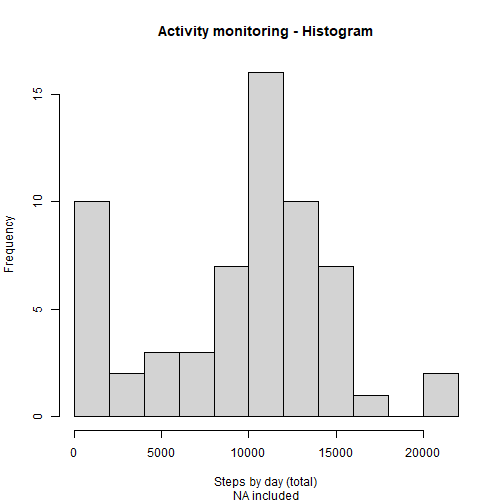
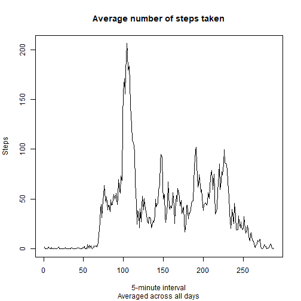
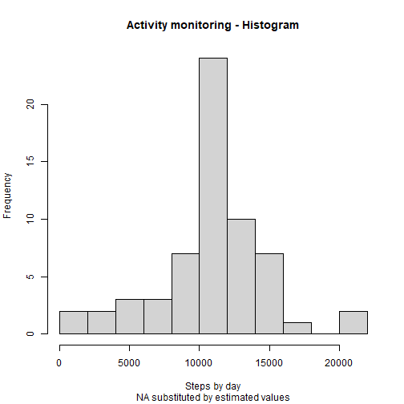
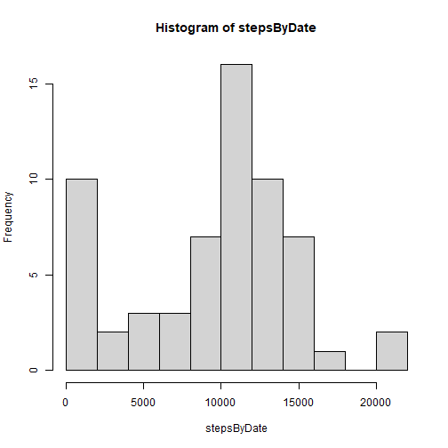
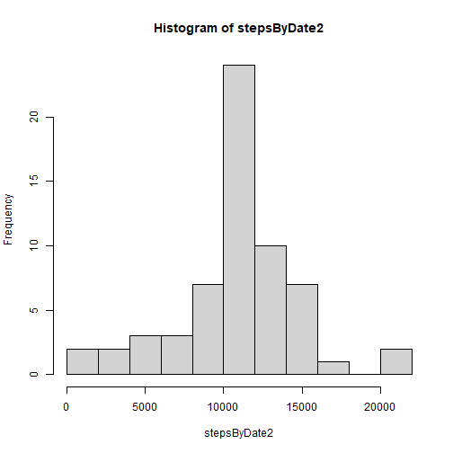
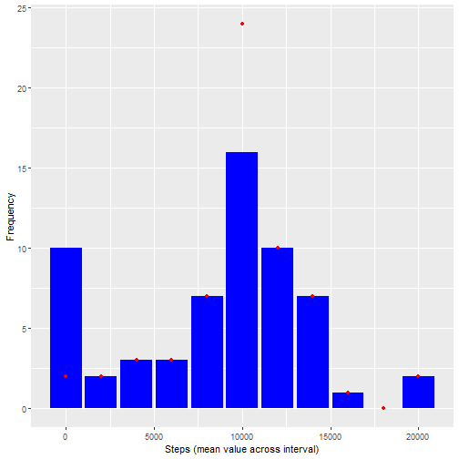
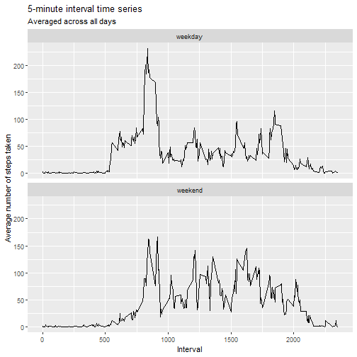

Reproducible Research - Course Project 1: Activity monitoring.
===
# Part 1: Loading the data:

The data file is downloaded from the repository in the working directory:


```r
fileURL <- "https://d396qusza40orc.cloudfront.net/repdata%2Fdata%2Factivity.zip"
tempFile <- tempfile()
download.file(fileURL,tempFile)
```

Then, the data file is unzipped and read into a dataframe:

```r
AD_name <- "activity.csv"
data <- read.csv(unz(tempFile, AD_name))
```

and the temp file is deleted:

```r
unlink(tempFile)
```

# Part 2: Processing the data:

## 2.1 - Mean total number of steps taken per day:

### 1. Calculate the total number of steps taken per day.

To calculate the total number of steps taken by day, we split the dataset by dates and we add up the steps from every interval, for each date, skipping the 'NA' values:

```r
stepsByDate <- unlist(lapply(split(data$steps, data$date), sum, na.rm=TRUE))
```

### 2. Make a histogram of the total number of steps taken each day.

We also plot a histogram with appropriate labels:

```r
hist(stepsByDate,
     10,
     main = "Activity monitoring - Histogram",
     sub = "NA included",
     xlab = "Steps by day (total)")
```



### 3.Calculate and report the mean and median of the total number of steps taken per day.

We calculate the mean and the median of the number of steps, by date, skipping the 'NA' values.


```r
meanSteps <- mean(stepsByDate, na.rm = TRUE)
medianSteps <- median(stepsByDate, na.rm = TRUE)

meanSteps
```

```
## [1] 9354.23
```

```r
medianSteps
```

```
## [1] 10395
```

## 2.2 - Average daily activity pattern:

### 1. Time series plot of the 5-minute interval (x-axis) and the average number of steps taken, averaged across all days (y-axis).

The mean number of steps by interval is calculated by splitting the data set by intervals and obtaining the mean value for each group across all days:

```r
stepsByInterval <- unlist(lapply(split(data$steps, data$interval), mean, na.rm=TRUE ))
```

The figure shows the time series plot of the 5-minute interval and the average number of steps taken, averaged across all days.

```r
plot(stepsByInterval, type='l', main="Average number of steps taken", sub="Averaged across all days", xlab="5-minute interval", ylab="Steps")
```



### 2. Which 5-minute interval, on average across all the days in the dataset, contains the maximum number of steps?

It is possible to determine the maximum number of steps on average across all days:

```r
max(stepsByInterval)
```

```
## [1] 206.1698
```

as well as the interval containing it:

```r
as.numeric(names(stepsByInterval[stepsByInterval==max(stepsByInterval)]))
```

```
## [1] 835
```

## 2.3 - Imputing missing values:

### 1. Calculate and report the total number of missing values in the dataset.

There are a number of days/intervals where there are missing values (coded as NA):

```r
sum(is.na(data$steps))
```

```
## [1] 2304
```

### 2. Devise a strategy for filling in all of the missing values in the dataset. The strategy does not need to be sophisticated. For example, you could use the mean/median for that day, or the mean for that 5-minute interval, etc.

The presence of missing days may introduce bias into some calculations or summaries of the data. That is why we have decided to fill in all the missing values with a non random value.

The devised strategy consists on filling each 'NA' value with the mean value of steps withing the correspondent interval.

For doing so, we use the mean values for each interval, skipping 'NA' values, calculated at 2.2.1:

```r
stepsByInterval <- data.frame(interval=names(stepsByInterval), steps=stepsByInterval)
```

### 3. Create a new dataset that is equal to the original dataset but with the missing data filled in.

We create a new data set by adding a new variable to the original one. This new variable contains the mean value of steps within the corresponding interval:

```r
data2 <- merge(data, stepsByInterval, by="interval")
```
The 'NA' values in the 'steps' variable are substituted by the new values:

```r
data2$steps.x <- ifelse(is.na(data2$steps.x), round(data2$steps.y), data2$steps.x)
data2<-data.frame(steps=data2$steps.x, date = data2$date, interval = data2$interval)
```

### 4. Make a histogram of the total number of steps taken each day and Calculate and report the mean and median total number of steps taken per day. 

The total number of steps taken each day are recalculated using the imputed values:

```r
stepsByDate2 <- unlist(lapply(split(data2$steps, data2$date), sum, na.rm=TRUE))
```

Now it is possible to plot a new histogram:

```r
hist(stepsByDate2,
     10,
     main = "Activity monitoring - Histogram",
     sub = "NA substituted by estimated values",
     xlab = "Steps by day")
```



and recalculate both the mean and median values:

```r
meanSteps2 <- mean(stepsByDate2, na.rm = TRUE)
medianSteps2 <- median(stepsByDate2, na.rm = TRUE)
```

### 5. Do these values differ from the estimates from the first part of the assignment? 

The new values differ from the estimates from 2.1.3:

```r
meanSteps2 - meanSteps
```

```
## [1] 1411.41
```

```r
medianSteps2 - medianSteps
```

```
## [1] 367
```

We can compare the frequencies on the first histogram (blue bars) and the second one (red dots) to see where the changes are:

```r
comparison <-
    data.frame(
        'tics' = hist(stepsByDate, 10)$breaks[1:11],
        'with' = hist(stepsByDate, 10)$counts,
        'without' = hist(stepsByDate2, 10)$counts
    )
```



```r
library(ggplot2)
```

```r
graphic1 <- ggplot(comparison, aes(x=tics, y=with))+
    geom_bar(stat="identity", fill = 'blue')+
    geom_point(aes(y=without), colour='red')+
    labs(x="Steps (mean value across interval)", y="Frequency")
graphic1
```



### 6. What is the impact of imputing missing data on the estimates of the total daily number of steps?

The estimated impact of imputing missing data on the estimates of the total daily number of steps is the loss of steps:

```r
sum(stepsByDate2) - sum(stepsByDate)
```

```
## [1] 86096
```

## 2.4 - Are there differences in activity patterns between weekdays and weekends?

### 1. Create a new factor variable in the dataset with two levels – “weekday” and “weekend” indicating whether a given date is a weekday or weekend day.

A new variable 'dayType' is calculated in the dataset. It is a factor variable with two levels: weekday and weekend:

```r
data2$dayType <- as.factor(ifelse(weekdays(as.Date(data2$date)) %in% c("sábado", "domingo"), "weekend", "weekday"))
```

### 2. Make a panel plot containing a time series plot of the 5-minute interval (x-axis) and the average number of steps taken, averaged across all weekday days or weekend days (y-axis). 

To make the panel plot, we start grouping the data by type of day and interval, we calculate, for each record, the mean value of steps across the day and interval and we discard repeated records (we use the functions in the dplyr library):

```r
library(dplyr)
```

```r
data2ByDayType <- data2[,c("steps", "interval", "dayType")] %>%
    group_by(dayType, interval) %>%
    mutate(steps = mean(steps)) %>%
    unique()
```

We use the library ggplot2 to build a faceted plot. Each panel contains a time series plot of the 5-minute interval and the average number of steps taken, averaged across all weekday days or weekend days. 

```r
graphic2 <- ggplot(data2ByDayType, aes(x=interval, y=steps))+
    geom_line()+
    facet_wrap(~dayType,  ncol=1, strip.position = "top")+
    labs(
        x = "Interval",
        y = "Average number of steps taken",
        title = "5-minute interval time series",
        subtitle = "Averaged across all days"
    )
 
graphic2
```



# ***
